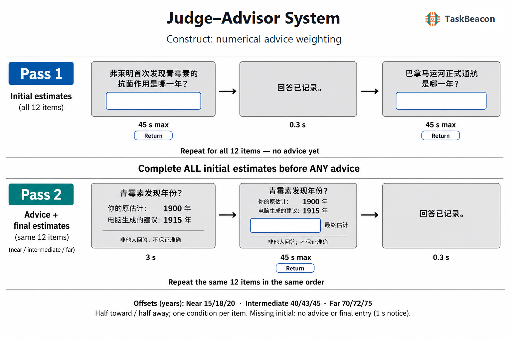

# Judge–Advisor System

| Field | Value |
| --- | --- |
| Name | Judge–Advisor System (disclosed mechanical advice) |
| Version | v0.1.0 |
| URL / Repository | https://github.com/TaskBeacon/T000139-judge-advisor-task |
| Short Description | Two-pass independent estimates, advice and final revisions |
| Created By | TaskBeacon |
| Date Updated | 2026-08-31 |
| PsyFlow Version | 43e52fb or newer compatible version |
| PsychoPy Version | 2025.2.4 |
| Modality | behavior |
| Language | Chinese, SimHei |
| Voice Name | zh-CN-YunyangNeural (voice disabled) |

## 1. Task Overview

T000139 implements a transparent mechanical-advice adaptation of [Yaniv (2004)](https://doi.org/10.1016/j.obhdp.2003.08.002). Participants first independently estimate twelve historical years, then revisit the same questions with their own prior estimates and explicitly computer-generated advice. Final revisions quantify advice use. The twelve original Chinese items are fact-checked but **not psychometrically validated**. There are no human advice recordings, invented advisers, reliability claims, norms, clinical interpretations or promised accuracy gains. The task is not an ecological human-adviser replication. See [source audit](references/task_logic_audit.md) and [material provenance](references/materials.md).

## 2. Task Flow

### Block-Level Flow

| Step | Behavior |
| --- | --- |
| Instructions | Explain numeric input, two passes, deadlines, honest computer provenance and missing-data rules. |
| Initial pass | All 12 unique questions answered without any advice; save a separate initial-pass CSV. |
| Transition | Explain the upcoming advice/revision phase; wait for Space. |
| Revision pass | Repeat the same item order and logical IDs. A valid initial with advice inside the numeric domain receives advice then a blank final field; unavailable initial/advice values receive a notice. |
| End | Neutral goodbye; save one final reduced row per paired item, with all initial/advice/final phase data. |

### Trial-Level Flow

| Pass | Phase | Visible content | Duration / response |
| --- | --- | --- | --- |
| Initial | initial | Historical-year question, blank textbox | Return submission, 45 s maximum |
| Initial | initial_saved | Neutral recording notice |0.3 s|
| Revision | advice | Own prior year, generated advice, truthful source label |3 s|
| Revision | final | Same question and advice, new blank final textbox |Return submission, 45 s maximum|
| Revision | final_saved | Neutral recording notice |0.3 s|
| Revision, unavailable | unavailable | Initial estimate or generated advice unavailable notice |1 s; no advice/final capture|

### Controller Logic

| Mechanism | Rule |
| --- | --- |
| Paired memory | Retain initial result dictionaries by item; preserve helper-assigned logical trial ID across passes. |
| Schedule | Seed 139031 + subject ID; shuffle unique items and exactly balanced 3 distance × 2 direction cells, then sample the configured offset. |
| Advice | Near 15/18/20, intermediate 40/43/45, far 70/72/75 years. Sign points toward/away from truth according to preassigned cell. At exact-truth ties, toward uses positive and away negative, explicitly flagged. |
| Bounds | Shared integer domain ±1,000,000,000 keeps every subtraction/error intermediate exact in Python/JS. No clipping; out-of-domain advice is not presented. |
| Adaptation | No difficulty controller or rewards. Toward advice may overshoot and increase error. |

### Other Logic

| Field / policy | Meaning |
| --- | --- |
| weight_of_advice | `(final-initial)/(advice-initial)`, preserving negative and above-one values. |
| absolute_revision_ratio | Separate `abs(final-initial)/abs(advice-initial)`; not substituted for signed WOA. |
| self_weight |1−WOA, null when WOA undefined.|
| zero distance | Advice=initial produces null weights and explicit reason; never fabricated zero. |
| accuracy_gain | Initial absolute error minus final absolute error; positive means improvement. |
| Missing submission | Draft text retained; unsubmitted content is not an estimate. No initial imputation or final default. |
| Validity | Signed ASCII integer input; blank/invalid/out-of-range/timeout separated. Zero and negative years retained. Implausible years flagged independently of validity. |
| Preservation | Separate initial-pass CSV is written before transition. Final paired CSV includes unchanged prefixed initial phase columns. |

## 3. Configuration Summary

Settings are from `config/config.yaml`. `total_trials:12` means 12 logical pairs; `total_blocks:1`, `passes:2` and `trial_per_block:12` mean one logical block revisited in 24 pass presentations. `pair_complete` means the item was processed in both passes, not that both answers were valid. `config_qa.yaml`, `config_scripted_sim.yaml` and `config_sampler_sim.yaml` contain explicitly synthetic 6-item fixtures and shorter timing; they are not human behavioral evidence. Human mode forcibly disables fixture prefills.

### a. Subject Info

| Field | Meaning |
| --- | --- |
| subject_id | Three-digit integer 101–999; controls reproducible item/cell assignment. |

### b. Window Settings

| Parameter | Value |
| --- | --- |
| size / units |1280×800 pixels|
| background / font |white / SimHei|
| fullscreen |false|
| monitor width/distance |35.5/60 cm nominal metadata, not physical calibration|

### c. Stimuli

| Name | Type | Description |
| --- | --- | --- |
| instruction/transition/good_bye |text|Chinese task, response and computer-provenance explanation|
| question |text|Original historical-year question; source-verified truth remains hidden|
| initial_editor/final_editor |textbox|Fresh blank input each phase; no numeric defaults|
| own_estimate/recommendation/provenance |text|Own original year, generated advice and truthful source label|
| final_own/final_advice/final_provenance |text|Same information remains during revision|
| saved/unavailable |text|Neutral notice, never accuracy feedback|

### d. Timing

| Phase | Duration |
| --- | --- |
| initial/final |45 s maximum each, response terminates|
| advice |3 s|
| saved |0.3 s|
| unavailable |1s|
| instruction/transition/goodbye |until Space|

### Triggers

| Event | Code |
| --- | --- |
| experiment start/end |1/99|
| initial onset/submit/timeout/saved |10/11/19/20|
| advice onset |30|
| final onset/submit/timeout/saved |40/41/49/50|
| unavailable onset |60|

Behavioral mock driver; software events are not hardware calibration. A timeout trigger means no registered submit key, not invalid numeric text.

### Adaptive Controller

| Parameter | Value |
| --- | --- |
| adaptive timing / difficulty |none|
| paired memory |item-specific initial dictionary only|

## 4. Methods (for academic publication)

Participants estimate twelve independently authored historical-event years in Chinese in a two-pass computer task. The first pass collects independent typed estimates with a 45-second deadline and no advice. After every initial estimate is complete, the same questions are revisited in the same order. The participant’s original estimate and a numerical recommendation are displayed for 3 seconds, then remain visible while a new blank final-response textbox is available for 45 seconds. Advice is openly described as computer-generated, not as another person’s recorded judgment. No correct answers, performance feedback or financial bonus are provided.

The item plan balances near, intermediate and far offsets with directions toward and away from the true year. It retains the cited Study 3 offset sets while adapting the number of items, language, timing, disclosure and incentive policy. Direction is geometric: an offset may overshoot truth, and true-initial ties are separately flagged. The primary descriptive outcome is signed advice weight; revisions, all raw values, absolute errors and accuracy changes are also retained. Undefined weights and missing responses are not imputed. These new materials and engineering parameters require piloting; results cannot establish human-adviser trust, a guaranteed advice benefit, normative performance or clinical validity.

Run `python main.py human`, `python main.py qa`, or `python main.py sim --config config/config_sampler_sim.yaml`. Publication validation and limitations are archived under `references/validation/`. Native physical Return/IME behavior is distinct from simulated-key tests; browser normalization of Return to raw `enter` is documented in the derived web task.

Native cross-phase order must use shared-window `flip_time` / `offset_flip_time`; current `onset_time_global` has coarse whole-second precision and is unsuitable for subsecond comparisons. Captured images verify actual OpenGL drawing; physical display scanout and real OS keyboard submission have not been established by the synthetic checks.

The H companion's task stages likewise contain no truth or accuracy feedback. Its shared operator export panel after task completion displays analysis fields, including truth; operators should keep that panel outside the participant workflow.
